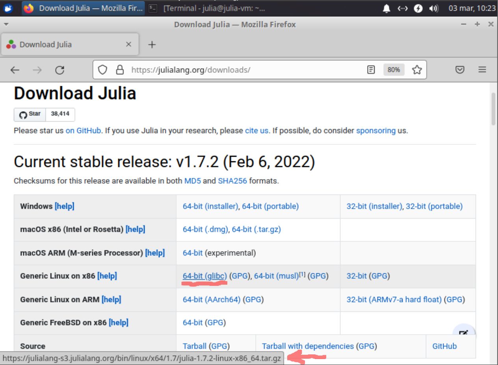
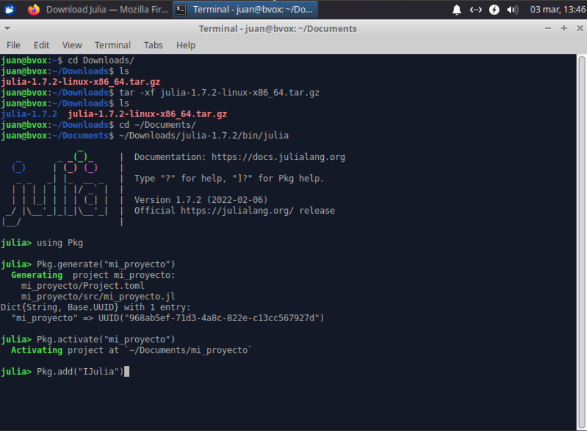
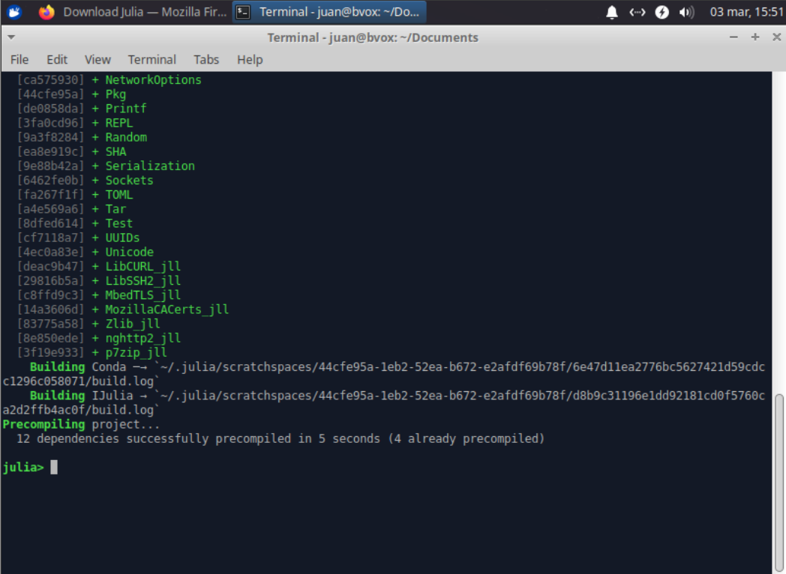
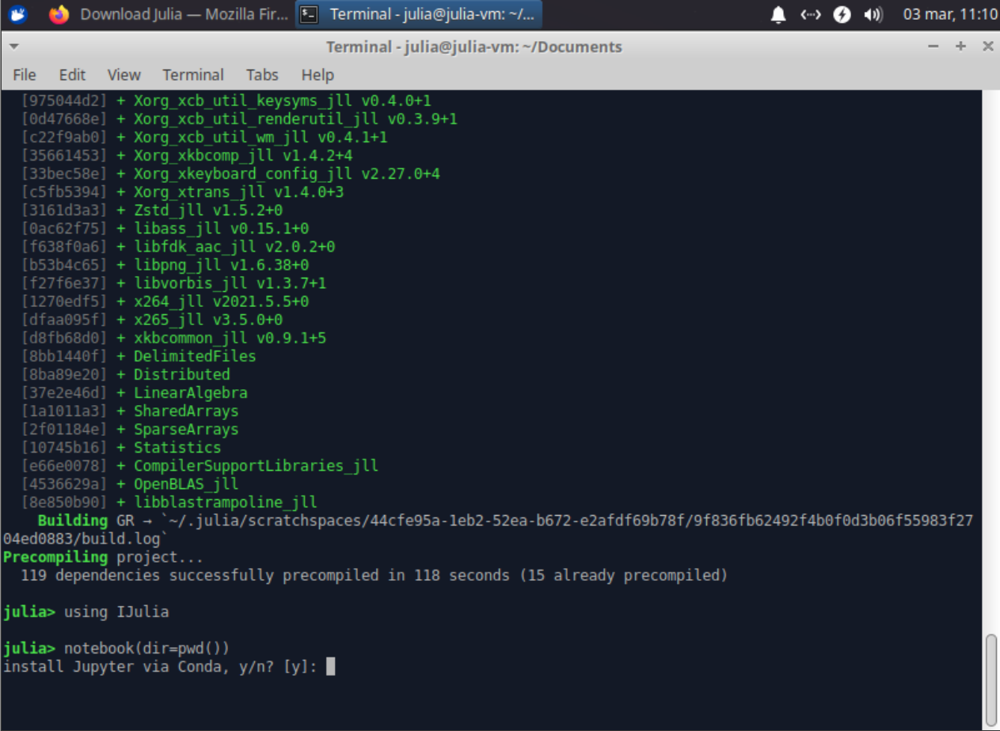
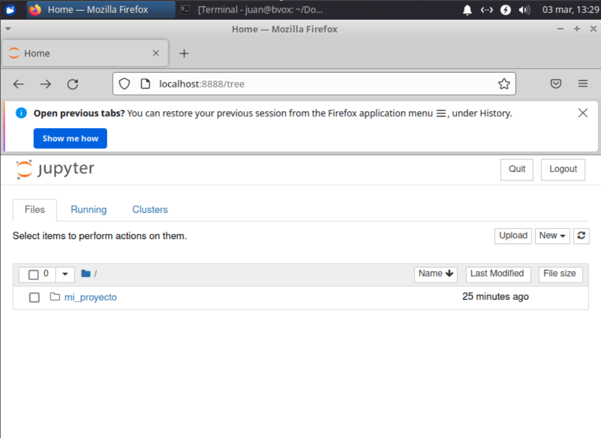
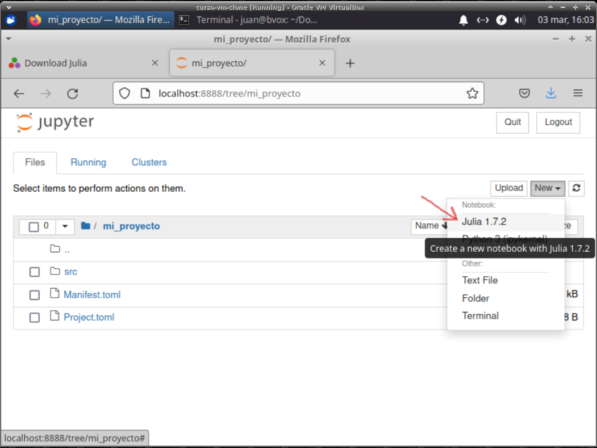
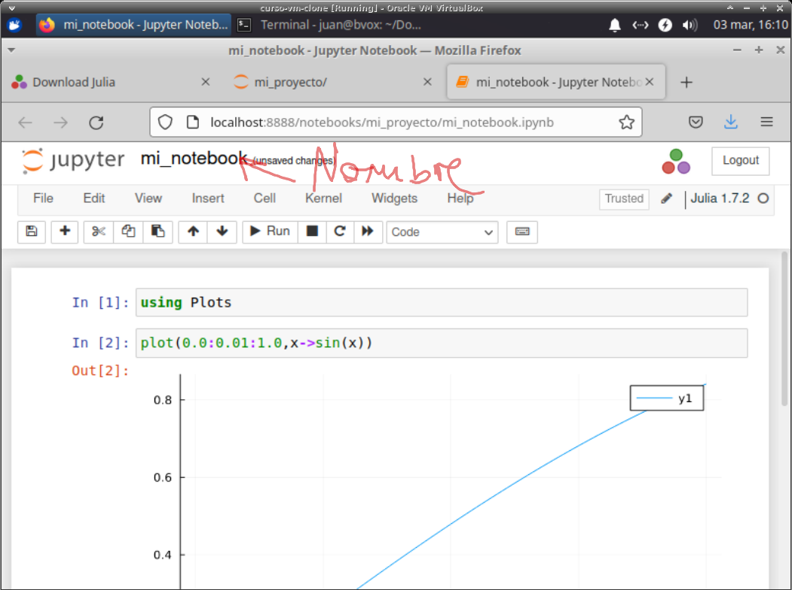

## Cómo instalar Juila, Jupyter y el paquete Plots

Instrucciones para la instalación específicas de Julia a cada sistema operativo pueden ser encontradas en [https://julialang.org/downloads/platform/](https://julialang.org/downloads/platform/). Aquí mostramos los pasos para el caso de Xubuntu Linux.

Alternativamente, Oscar nos ofrece un tutorial muy bueno [https://github.com/reula/Metodos_Numericos_2022/blob/main/Tutoriales/Julia_Install.md](https://github.com/reula/Metodos_Numericos_2022/blob/main/Tutoriales/Julia_Install.md).

Continuemos con el tutorial:

1. Ir a [https://julialang.org/downloads/](https://julialang.org/downloads/).
        
2. Baje la versión acorde al sistema operativo de su computadora (Windows, Linux, etc.). Hoy en día casi todas las computadoras son de 64 bits, pero por las dudas constate en su caso si su sistema operativo soporta aplicaciones de 32 o 64 bits y baje el que corresponda. En este tutorial consideraremos el caso de un Linux generico de 64 bits (ej. Ubunut), por lo que descargaremos el archivo `julia-1.7.2-linux-x86_64.tar.gz` (ver imagen).

        
3. Descomprimir el archivo `julia-1.7.2-linux-x86_64.tar.gz` en la carpeta que desee:

4. Vaya a una carpeta en donde quiera trabajar (ej. `Documents`) e inicie la consola de Julia

        julia@julia-vm: cd ~/Documents
        julia@julia-vm: ~/Downloads/julia-1.7.2/bin/julia
        
5. Active el paquete `Pkg` y genere un proyecto nuevo

        julia> using Pkg
        julia> Pkg.generate("mi_proyecto")

6. Active el proyecto

        julia> Pkg.activate("mi_proyecto")

7. Instale el paquete `IJulia` escribiendo en la consola de Julia

        julia> Pkg.add("IJulia")
        
Ud. debería ver algo así        
        

y al finalizar el proceso de instalación del paquete `IJulia` Ud. debería ver algo así

        
8. De manera similar, instale el paquete `Plots` escribiendo en la consola de Julia

        julia> Pkg.add("Plots")
               
9. Luego activamos el paquete `IJulia` e iniciamos el administrador de notebooks en el actual directorio

        julia> using IJulia
        julia> notebook(dir=pwd())

Es probable que al hacerlo, Julia le pregunte si desea instalar `Jupyter` via `Conda`. Acepte presionando la tecla `y`

Luego de un rato debería ver el administrador de notebooks de `Jupyter`

        
10. En el administrador de notebooks ingrese a la carpeta `mi_proyecto` y cree una nueva notebook de Julia

11. Finalmente, después de cambiarle el nombre a la notebook de `Untitled` a `mi_notebook`, probamos graficar una función en la notebook

